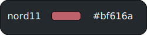
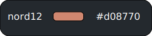

# Nord Colortheme for LaTeX

Checkout [Nord color theme](https://www.nordtheme.com/) for more details about this awesome color theme

See [Nord Palettes](https://www.nordtheme.com/docs/colors-and-palettes) for colors and style guides.


### Usage:
- Clone the repo
```
git clone https://github.com/vskvj3/nord-latex-theme
```

- Copy nordtheme.sty to the directory of your LaTeX project
- add \usepackage{nordtheme} to your preamble
```
\usepackage{nordtheme}
```

- You can use (for example) \color{aurora3} in your LaTeX code to change the color of specific text
```
\color{aurora3}
```

### Color Reference:
#### Polar Night


#### Snow Storm


#### Frost


#### Aurora




